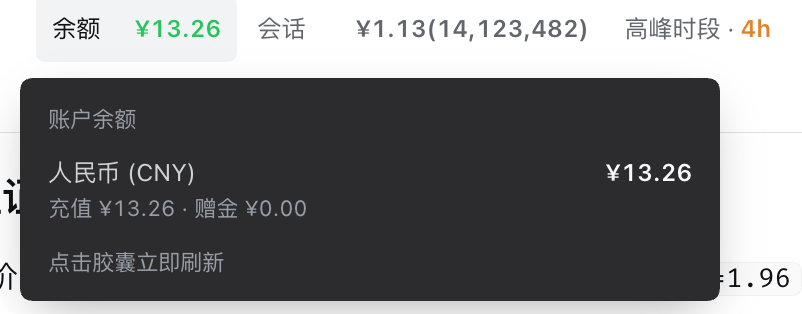
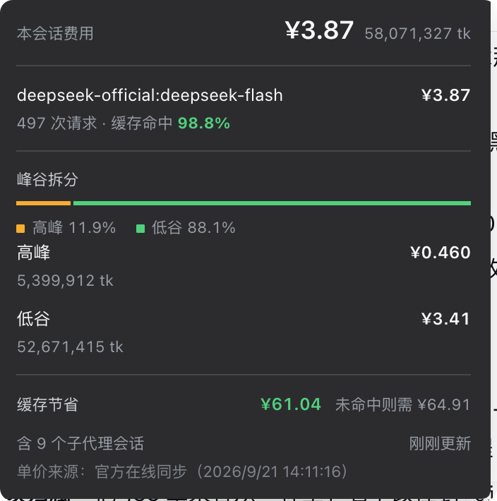
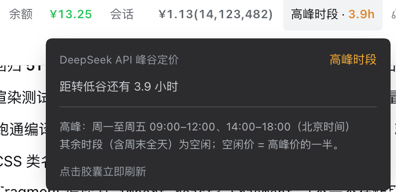

# dsh-billing

DeepSeek Harness 插件：**账户余额** + **会话费用**（人民币），带 Web UI 悬浮显示。

## 功能

| 入口 | 用法 | 说明 |
| --- | --- | --- |
| UI 会话头部三胶囊 | 无需操作，常驻显示 | **余额 + 本会话费用 + 峰谷时段** 并排显示在会话标题旁；三个数字都是 NumberFlow 逐位滚动；点击任一胶囊立即刷新余额与会话费用（三颗一起显示加载态） |
| 悬停明细 | 鼠标悬停 / 键盘聚焦 | **自定义浮层**（不再用原生 `title`）：余额（充值/赠金/美元）、会话费用（分模型拆分 + 占比条 + 缓存命中率 + 峰谷拆分 + 缓存节省）、峰谷规则原文 |
| 斜杠命令 `/balance` | 聊天框输入 `/balance` | 查询账户余额（人民币优先，附美元） |
| 斜杠命令 `/cost` | 聊天框输入 `/cost` | 当前会话费用明细 |
| 工具 `deepseek_billing` | 直接问模型"余额多少/花了多少钱" | query = `balance` / `cost` / `both` |

## 会话头部三胶囊

会话标题旁并排显示三个胶囊（适配 DSH 明暗模式，`--dsw-alias-*` design token）：


- **余额**：人民币金额（悬停看充值/赠金/美元明细；低于 `LOW_BALANCE_CNY`（默认 ¥5）标红，接口报 `is_available=false` 时显示「不可用」）
- **会话**：`¥费用(总 token 量)`。金额与 token 数字都带 **NumberFlow 逐位滚动动画**，且按链条时序：**金额先滚动，滚动结束后 token 数字随后滚动**；会话切换/加载中显示默认 `¥0.00(0)`（不残留上一个会话的数字），金额为 `¥0.00` 时 token 不动画
- **峰谷时段**：当前高峰/低谷 + 距下次切换的剩余时间（数字同样走 NumberFlow；峰谷规则由宿主 `/billing/tide` 下发，客户端随分钟自算，到点即翻转）

数字变化时逐位滚动（[NumberFlow](https://number-flow.barvian.me)，odometer 式：**只滚动值变化的位，未变的位静止**），含 `prefers-reduced-motion` 守卫（NumberFlow 内置 `respectMotionPreference`）。

## 悬停浮层（实机截图）

三个胶囊的悬停 / 键盘聚焦明细都是**自定义浮层**（暗底，沿用 DSH 的 `--dsw-alias-tooltip-bg`），取代原生 `title` —— 系统 tooltip 延迟约 1 秒、纯文本、数字无法对齐、暗色模式样式不可控。浮层动效走 [transitions.dev](https://transitions.dev) 的 `17-tooltip` 配方：进场 80ms 延迟 + 150ms fade/scale，离场 50ms 立即（`transition-delay` 只写在 hover 规则里，所以移开不粘手）。

**余额** —— 人民币 / 美元的总额、充值、赠金；接口报 `is_available=false` 时标注「当前不可用」：



**会话费用** —— 分模型拆分（模型 + 金额 + 请求次数 + 缓存命中率）与**峰谷拆分**（高峰 / 低谷各自金额 + token 数）；多于 1 个模型 / 多于 1 个峰谷档时给 3px 占比条与内联图例；底部给出「缓存节省」与「未命中则需」对照价；脚注是子代理会话数与数据新鲜度（相对时间）：



改前样式留作对照：[`docs/screenshots/popover-cost.png`](./docs/screenshots/popover-cost.png)（0.7.2 之前，缺「缓存节省」行与「峰谷拆分」段）。

**峰谷时段** —— 当前时段、距切换时长、官方规则原文：



> 图摄于本机实机环境，数字为真实用量。除 `popover-cost.png` 外均为当前样式；`popover-cost.png` 是 0.7.2 之前的旧样式（缺「缓存节省」行与「峰谷拆分」段），留作对照。设计稿的四个方向见 [`docs/mockup/`](./docs/mockup/)。

## 0.7.2：会话费用浮层新增「峰谷拆分」——高峰花了多少、低谷花了多少

0.7.0 / 0.7.1 把峰谷**判定**做对了，但峰谷只体现在「峰谷时段」胶囊上——那颗胶囊回答的是「**现在**几点、离切换还有多久」，**不回答「过去高峰花了多少、低谷花了多少」**。一个会话只要横跨 12:00 / 14:00 / 18:00 的窗口边界（或跨天、跨周末），费用就被峰谷价打包成一个数，看不出两档各占多少。

而这个数字其实**早就算出来了，只是被丢掉**：`summarize()` 对每个用量桶都调了 `rateAt(entry, bucket.time)`，它返回 `{ rate, mode }`——代码只解构 `rate` 拿去算钱，`mode`（`peak` / `off-peak` / `flat`）被扔掉。0.7.2 把它留下来按档聚合，下发到浮层。

本版本改动：

- **`host.js` 抽出 `priceBucket()`**（单桶计价）：`summarize()`（按模型）与新增的 `summarizeTide()`（按峰谷）**共用同一段计价代码**。这是本版最在意的一条——两条聚合**同源**，故「按模型加总」恒等于「按峰谷加总」，不会出现两套数对不上账
- **`host.js` 新增 `summarizeTide()`**：按 `mode` 聚合每档的金额 / 三类 token / 请求次数；排序固定「高峰 → 低谷 → 无峰谷档」
- **`costPayload` 新增 `tide` 字段**（`mode` / `cost` / `tokens` / `steps`）。两条聚合同用**同一个 `nowMs`** 取样，避免各自取到不同的当前时间
- **`client/src/index.tsx` 新增 `TideSplit` 段**：插在模型明细之后、缓存节省之前，**复用模型拆分那套「3px 占比条 + 逐行金额」的视觉语言**（高峰琥珀、低谷绿，与峰谷浮层的语义色一致）
- **`client/src/pills.css`**：新增 `.billing-seg-peak` / `.billing-seg-off` / `.billing-seg-flat` 配色与段标题 `.billing-pop-sect`
- **回归**：`scripts/verify-pricing.mjs` 新增 I 段 **13 项断言**

三个刻意的决定：

1. **`flat` 单独成档，不混进低谷**。2026-08-17 峰谷制之前的请求，`rateAt` 返回 `mode: 'flat'`；把它算作低谷等于**谎报「全在低价时段」**，故单列一行「无峰谷档」。
2. **单档不画占比条，但保留行**。单档恒为 100%，条是噪声（与模型拆分的取舍一致）；但「低谷 ¥3.41 · 52,671,415 tk」正是「这次全在低谷」的答案，不是冗余。
3. **拆分粒度是「每次请求」，不是「会话」**。每个用量桶带自己的 `time`，故跨子代理会话聚合时天然按各自时刻分档，不需额外处理——这正是「高峰也在用、低谷也在用、一直在用」能分别算出来的根本原因。

I 段断言覆盖：高峰/低谷各成一行与排序、两档单价正确（flash 高峰 2.0 / 低谷 1.0 元每百万未命中）、**按模型合计 === 按峰谷合计**、token 与请求次数分档、**11:59 / 12:00 跨边界分两档**（窗口端点是闭区间起点）、周六与国庆 10-01 归低谷、2026-08-17 之前归 `flat`、无 `usage` 的桶不计入、跨会话（父高峰 + 子低谷）按各自时刻分档。

实机核验：本机一个跨 09-17（周四 10:42，高峰）→ 09-20（周日 13:16，低谷）的会话被正确拆成 `peak ¥0.0733 / off-peak ¥0.0324`，逐步核对每一步的时间与分档无错判。宿主侧改动需**重启 `dsh web`**，客户端改动**刷新页面**即可。

## 0.7.1：补齐节假日规则的两处对外文案 + 新增同步链路探针

0.7.0 只改了判定逻辑，两处**用户可见的规则原文**漏了，口径与实际计费不一致：

- `host.js` 的 `/cost`、`deepseek_billing` 输出「说明」行仍写「2026-08-17 起峰谷价、周末全天空闲价」，没提法定节假日
- `client/src/index.tsx` 峰谷浮层里的官方规则原文仍写「高峰：周一至周五 09:00–12:00、14:00–18:00」

两处均已对齐官方 09-19 说明，`client.js` 已重建（浮层那句要**刷新页面**才生效）。

**新增 `scripts/probe-sync.mjs`** —— 回答「『单价来源：官方在线同步』是真的还是机制空转」。在独立 node 进程里真实调用 `apply()`，套假宿主 ctx（commands / tools / connection.rpc / logger 全接到本地收集器）+ 可注入的 fetch 与 setTimeout，覆盖四个场景共 12 项断言：正常联网（真发请求 → HTTP 200 → 走成功分支 → 12h 周期）、断网、官方页 500、200 但无价格表（这三种必须**明确判失败 + 60s 退避**，尤其第四种不许拿残缺数据冒充成功）。不启动、也不影响运行中的 dsh web。

## 0.7.0：中国法定节假日全天空闲（对齐官方 2026-09-19《API 峰谷时间说明》）

官方 2026-09-19 发布 API 峰谷时间说明：**调休上班的周末、中国法定节假日全天均按空闲时段计费**。定价页脚注同步为「北京时间周一至周五（**不含中国法定节假日**）9:00–12:00、14:00–18:00 为高峰时段；其余时段，包括周末及中国法定节假日全天均为空闲时段」。

改前本插件只按「周六/周日」判空闲，没有节假日表，因此中秋、国庆里落在**工作日**的假期会被按高峰价（2 倍）计费：中秋 **09-25（周五）**，国庆 **10-01、10-02、10-05、10-06、10-07**。

本版本改动：

- **`host.js` 新增 `CN_HOLIDAYS`**：按《国务院办公厅关于 2026 年部分节假日安排的通知》只收**当次通知**的中秋（09-25~09-27）与国庆（10-01~10-07）。其余假期不收录，按普通工作日峰谷判定——口径偏保守：宁可把假日高峰误报成高峰，也不把工作日高峰误报成空闲
- **`rateAt()` 判定顺序**：周末 → 法定节假日 → 峰谷窗口，任一命中即返回空闲档。补班日（09-20 周日、10-10 周六）**不做特殊处理**：周末规则本身已判空闲，与新规一致
- **`schedule` 新增 `holidayOffPeak` / `holidays` 字段**：随 schedule 走，不回溯改写历史档；可用 `config.pricing[<模型>].holidays` 覆盖，`holidayOffPeak: false` 关掉
- **`/billing/tide` 一并下发节假日规则**（`holidays` + `holidayOffPeak`）：客户端 `tide.ts` 兜底自算用同一份表，避免 RPC 抖动时胶囊跳档
- **回归**：`scripts/verify-pricing.mjs` 新增 C2 段（节假日全天空闲 / 补班周末 / 相邻工作日对照 / 主开关 / 北京时间日界 / tide 载荷）与 C3 段（编译 `client/src/tide.ts`，9 个样本对齐 host 结论），共 **74 项断言**

> 有意不做节假日在线同步：GitHub 源在国内不稳，且一年只变一次。新通知发布后往 `CN_HOLIDAYS` 追加日期即可。

## 0.6.10：修正 0.6.9 的错误判断 —— 那不是「未落盘」，是 dsh 拒绝重建 fork 会话

0.6.9 我把「读取失败」归因为「事件日志未落盘」，**这个判断是错的**。加了 stderr 上报后拿到了确切错误：

```
[dsh-billing] 会话 session-dcc1284f-… 的事件日志不可读：
seeded session constructor seed must equal its inherited prefix
```

对照该会话的 identity：`isSeeded: true`、`inheritedEventCount: 414` —— 它是 **fork 出来的子代理会话**；而它的日志文件**好好地存在着**（`session.v3.jsonl.zstd`）。断言抛自 `packages/core/session/src/index.ts:600`：dsh 从存储重建 seeded 会话时要求「构造函数 seed == 继承前缀长度」，这个校验没过，于是**拒绝重建**。

- `isMissingLogError()` → 更名 **`isSkippableReadError()`**（原名在语义上就是错的），正则补上 `seeded session` / `inherited prefix`
- 措辞改准：不再说「事件日志未落盘」，改为「fork 子代理会话无法回读」
- 回归新增：**正则 6 个用例**（真实 seeded 错误 / ENOENT / not found → 跳过；JSON 解析失败 / EACCES / EBUSY → 报警）

这类失败**插件无法修复**（属 dsh 的重建约束）。若要让这笔费用也不再漏，可行方向是改用投影缓存里的 `tokenUsage` 总量（该会话的投影可读：`uncachedInput 87719 / output 82718 / cacheRead 4709760`），但需要读 `~/.dsh/storages/session_projcache/` 的内部路径，且投影没有模型维度、只能按该会话最后使用的模型估算 —— **暂不做**。

## 0.6.9：区分「已结束会话未落盘」与「真的读取失败」

0.6.4 起浮层脚注会显示 `⚠️ N 个日志读取失败`。实测这行字有两个毛病：**说不清后果**，而且**把正常现象当成了错误**。

**根因**：dsh 现在只写投影缓存（`~/.dsh/storages/session_projcache/`），**事件日志不再落盘**（`~/.dsh/sessions/*.zstd` 里最新那份还是 7 天前）。于是**任何已结束的会话都无法回读完整事件** —— 这是机制变化，不是故障。

- **`host.js` 拆开两类失败**：`isMissingLogError()` 按错误文本识别「文件不存在」类，记入新增的 `missing` 计数（不报警）；其余（损坏 / 权限 / 解析）才计入 `failed` 并经 `reportReadFailure()` 上报
- **失败去重上报**：`ctx.logger` 在本插件上下文里**实测不落盘**（0.6.4–0.6.8 期间那句 `ctx.logger?.warn?.` 一个字都没写出来），故改为同时 `process.stderr.write` 兜底；同一会话只报一次，避免每次 RPC 刷屏
- **UI 分两级**：真失败 → 显眼警告「⚠️ N 个会话事件日志读取失败」；已结束会话 → 沉到最淡的灰字脚注「另有 N 个已结束会话未计入（事件日志未落盘）」
- `costPayload` 新增 `missingSessions`；`/cost` 文本同步区分
- **为什么不用官方投影替代**：`tokenUsage` 投影只有总量（uncachedInput / output / cacheRead / cacheWrite），**没有模型维度**，而算钱必须按模型分别计价；`TurnTokenUsage.routes` 只列出涉及过哪些 route，不拆 token 数。故插件自建的事件遍历仍是必需的

回归：浮层渲染 **21 项**（新增 failed / missing 四种组合）、定价 51 项全绿。

## 0.6.8：时段胶囊补上刷新加载态（三个胶囊点击反馈一致）

点了任意胶囊都会刷新 cost + balance，但 `is-refreshing` 此前只加在余额与会话上 —— 于是点「时段」时，看到的是**余额和会话在变暗、时段自己毫无反应**，反馈指向了错误的元素。现给时段胶囊补上同一个类。

注：本版按「保持点谁刷全部」的决策实现，因此点「时段」仍会触发两个与它无关的远端请求（峰谷本身是客户端本地计算的）。这一点是**有意保留**的，不是疏漏。

## 0.6.7：三个胶囊的数字统一走 NumberFlow + 修掉「切会话时余额数字淡出」

两个问题其实是同一个根因，都由 0.6.5 / 0.6.6 引入：

- **切会话时余额数字「淡出」**：挂载 / 切会话的 effect 调的是带加载态的 `refreshAll()`，它会 `setRefreshing(true)` 把余额数字压到 40% 透明度，还被 `REFRESH_DIM_MIN_MS = 220` 强留 220ms。**余额是账户级数据、与 session 无关，不该跟着变暗**（看起来像在加载或正在消失）。现拆成两个函数：
  - `refreshQuiet()` —— 只取数，不发加载态、不动任何数字；挂载 / 切会话 / 轮次结束 / 切回前台都走它
  - `refreshByClick()` —— 带加载态 + 保底可见时长；只由用户点击触发
- **余额数字「没有动效」**：`Rolling` 在无数据时传 `value={null}`，会渲染成普通 `<span>…</span>`，数据到达才切成 NumberFlow —— **首挂载直接显示数字，不滚动**。现与 `SessionAmount` 统一口径：无数据时传 `0`，NumberFlow 始终挂载，数据到达时逐位滚上去；只有请求失败才退回占位符
- **时段胶囊补上 NumberFlow**：此前它是纯文本 `{fmtRemainShort(...)}`（如 `3.9h`），是三个胶囊里唯一没有数字动效的。现拆成 `value + suffix + fractionDigits`（`<1h` 显示整分钟；`>=1h` 一位小数且整数不带小数），走 `<Rolling>`

至此三个胶囊的数字**全部**是 NumberFlow：余额 1 + 会话 2（金额 + tokens）+ 时段 1 = **4 个实例**。`fmtRemainShort` 客户端不再使用（`tide.ts` 的导出保留，未删）。

## 0.6.6：撤掉刷新 pop —— 它动了数字子树，打断了 NumberFlow 的链条时序

0.6.5 用 `key={pulseKey}` 包住数字来重播 pop，**这是个实质性错误**：`key` 变化会让 `SessionAmount` 整个卸载重建 —— 内部 `tokensShown` 归零、NumberFlow 重新挂载，**「金额先滚、tokens 随后」的链条时序被打断**。

数字动效（NumberFlow 逐位滚动 + 链条时序）是既有实现，本次只该给**浮层**加 transitions.dev 动效，不该触碰它。本版撤回：

- `client/src/index.tsx`：删掉 `pulseKey` 与两处 `.billing-pulse` 包裹；`SessionAmount` 的用法与父级结构回到 0.6.3 原样（已用脚本逐字比对确认）
- `client/src/pills.css`：删掉 `dsb-refresh-pop` 关键帧、`.billing-pulse`、`--dsb-pop-*` token。**浮层的 17-tooltip 动效原样保留**（那才是本次要做的）
- **点击反馈保留「加载态」**：请求期间两颗真在取数的胶囊数字区降透明度。这是加载反馈（opacity 过渡，不改 DOM 结构、不重挂载），不是数字动效
- 新增 `REFRESH_DIM_MIN_MS = 220`：本地 RPC 可能几毫秒就返回，不保底的话「变暗」一闪而过，反馈等于没有
- 教训：**任何让既有动效宿主重挂载的「加动画」手段，都要先问它会不会打断宿主自己的时序**

## 0.6.5：悬停浮层动效对齐 transitions.dev + 点击刷新的确认反馈

0.6.4 的浮层是**条件渲染瞬间显隐**（零过渡），且点击刷新在数值未变时**毫无反馈**。本版补齐这两块：

- **浮层改用 transitions.dev `17-tooltip` 配方**：删掉 JS 定时器与 `openPop` state，改由纯 CSS 的 `:hover` / `:focus-visible` 驱动 —— 进场 80ms 延迟 + 150ms fade/scale(0.98)，离场 50ms 立即（`transition-delay` 只写在 hover 规则里，离开时延迟归零，所以不粘手）。`.billing-pop` 是过渡与桥接的载体（`padding-top: 8px` 既是视觉间隙也是 hover 区域，指针从胶囊移向浮层不会闪断），看得见的卡片是内层 `.billing-pop-card`
- **引入 transitions.dev 的 motion token**：统一加 `--dsb-` 前缀避免与宿主冲突（`--dsb-tt-*` / `--dsb-duration-quick` / `--dsb-pop-*`），替掉原先硬编码的 `120ms ease`
- **点击刷新的确认反馈**（原先缺的一环）：
  - 请求进行中：两颗真在取数的胶囊（余额 / 会话）数字区降到 40% 透明度
  - ~~请求结束：数字区重播一次 pop~~ —— **已被 0.6.6 撤销**：它需要让数字子树重挂载才能重播动画，而重挂载会打断 NumberFlow 的链条时序。详见下节
- **浮层时间戳改相对时间**：「14:03:47 更新」→「刚刚更新」/「12 秒前更新」。绝对时间在同一秒内连点两次看不出差别，相对时间一刷新就变
- **`prefers-reduced-motion`**：skill 每个片段都带的守卫全部保留（动效关闭时浮层仍正常显示，只是没有过渡）
- 回归：`testHooks` 增出 `relTime`；浮层渲染测试 17 项、SSR 测试 4 项全绿

## 0.6.4：悬停明细改为自定义浮层（不再用原生 `title`）

原生 `title` 的体验短板：延迟约 1 秒、纯文本、数字无法对齐、暗色模式下样式不可控、模型一多就糊成一块。本版把三个胶囊的悬停明细全部换成自定义浮层（暗底，沿用 DSH 的 `--dsw-alias-tooltip-bg`）：

- **会话费用浮层**：分模型拆分（模型名 + 金额 + 请求次数 + 缓存命中率）；多于 1 个模型时给 3px 占比条与内联图例；底部给出「缓存节省」与「未命中则需」的对照价——让「一个会话里 A 模型 + B 模型」的动态累加一眼可见
- **缓存节省是推算值**：`命中 token 数 ×（未命中价 − 命中价）`，由宿主算好随 `costPayload.cacheSaved` 下发。客户端只有金额与 token 数、没有单价，**算不出来**，故必须宿主提供。口径假设这些 token 若未命中会按未命中价计费，**不是账单值**
- **余额浮层**：人民币 / 美元的总额、充值、赠金；接口报 `is_available=false` 时直接标注「当前不可用」
- **峰谷浮层**：当前时段、距切换时长、官方规则原文
- **胶囊本体状态色**：改用官方 state token（`--dsw-alias-state-success-primary` / `state-warn-label` / `state-error-primary`），取代旧版硬编码的 `#43b97f` / `#e08a3e`——那两个色既不随主题切换，也偏离官方语义。余额低于阈值（`LOW_BALANCE_CNY`，默认 ¥5）标红
- **可访问性**：移除 `title` 后补 `aria-label`，并支持键盘聚焦展开浮层
- **构建**：`scripts/build.sh` 补 `--jsx-fragment=Fragment`（浮层用到 Fragment，缺它会编译成不在作用域的 `React.Fragment`）
- **回归**：`scripts/verify-pricing.mjs` 新增 H 段（缓存节省口径 3 项断言），共 51 项
- **设计稿**：`docs/mockup/`（A/B/C 三方向 + 选定的 D 版「克制版仪表盘」）
- **刷新策略如实化**：旧注释写的「轮次中每完成 10 步刷新一次」与实现不符——新版会话快照只暴露 `running`、不暴露 turn/step，这条能力拿不到，已从代码注释中移除（README 本就未记载）

## 0.6.2：会话费用聚合子代理（含去重）

主会话的费用/ token 统计从「仅本会话」改为「本会话 + 全部子代理后代会话」（含孙代理，递归）：

- **谱系发现**：`sessionQuery.traceSession` 一次拿到完整后代树；不可用或失败时降级为只统计本会话
- **继承去重**：子代理会话是 fork 出来的，日志开头物理复制了继承的父会话事件（`inheritedEventCount`），直接相加会重复计费——聚合时每个会话只取 `[inheritedEventCount:]` 之后自己产生的事件
- **key 防撞车**：跨会话合并时 stepKey 加会话 id 前缀（`collectUsage(events, keyPrefix)`），防止主/子会话同名 `turn:step` 互相覆盖
- **鲁棒性**：单个子会话日志读取失败跳过并计数（输出 ⚠️ 提示），绝不因个别损坏会话拖垮整体
- 三个入口统一：`/cost` 命令、`deepseek_billing` 工具、Web 胶囊 `/billing/cost` RPC（payload 新增 `subagentSessions`、`failedSessions` 字段）
- 回归新增 G 段：继承切片去重、跨会话防撞车、无前缀向后兼容

## 0.6.1：撤销 V4 Pro 下线切价（2026-09-13 校准）

官方 2026-09-13 在价格页脚注 (2) 更新公告：原定 **2026-09-14 的 V4 Pro 下线计划取消，9 月 14 日之后继续提供 V4 Pro API 服务、计费方式保持不变**。0.6.0 预置的「09-14 12:00 v4-pro 按 Flash 价计费」档与官方最终口径相反（若保留，9-14 之后 v4-pro 会**低估约 3.4 倍**），本版本已删除该档：

- `host.js`：`PRO_SERIES_RATES` 只保留 2026-08-17 起的 pro 价档（空闲 `0.15 / 4.5 / 13.5`，高峰 `0.30 / 9 / 27`），v4-pro 不再有切价档
- `scripts/verify-pricing.mjs`：同步更新断言（09-14 12:00 之后 v4-pro 仍 pro 价、pro 档数为 1），回归全绿
- 教训：**未来生效档的预置基于「官方公告」，公告随时可能被官方自己推翻**；预置后仍应在临近生效前复核价格页脚注，确认公告未被撤销

## 0.6.0：对齐官方现行价与模型下线计划（2026-09-11 校准，其中 V4 Pro 下线计划已被官方 09-13 公告撤销，见上节 0.6.1）

官方依据（定价页脚注原文）：
- 推荐模型名改为 **`deepseek-flash`**；旧名 `deepseek-v4-flash`、`deepseek-v4-flash-vision-exp` 已下线，仍可调用但由 V4.1-Flash 提供服务、**按 Flash 价计费**
- **V4 Pro 有序下线**：北京时间 **2026-09-14 12:00 之后**，`deepseek-v4-pro` 的请求全部路由到 V4.1 Flash，**并按 V4.1 Flash 价计费**
- 高峰定义：北京时间**周一至周五** 9:00–12:00、14:00–18:00，其余（含周末全天）为空闲；空闲价 = 高峰价的一半

本版本改动：

- **修掉「在线同步静默失效」**（关键）：官方表头写作 `deepseek-flash<sup>(1)</sup>`，剥标签后是 `deepseek-flash(1)`，旧解析器要求整串正则匹配 → 模型列识别为空 → 每次同步都返回 null。**同步机制一直在跑，但从未生效过**，费用一直吃内置硬编码表。现改为归一化后取模型名（容忍脚注角标 `(1)`、`[*]`、大小写），指标列也容忍 `<br>` 折行，同步真正生效
- **内置表补官方现行名**：新增 `deepseek-flash` 精确键（此前只靠 id 含 "flash" 命中系列锚点才碰巧算对）；`deepseek-v4-flash*` 归 flash 系列（官方口径同价）
- **预置 2026-09-14 12:00 v4-pro 按 Flash 价计费**：pro 系列新增一档，到点自动从 `0.30 / 9 / 27` 切到 `0.04 / 2 / 8`（空闲档 `0.15 / 4.5 / 13.5` → `0.02 / 1 / 4`）。不预置的话 9-14 之后 v4-pro 会**高估约 3.4 倍**
- **兜底价钉死**：仍为 pro 最高价 `0.15 / 4.5 / 13.5`，且**不再复用 pro 系列价目**——否则 9-14 会跟着降到 flash 价，把「未知模型」往低估方向带
- **峰谷判定改为分钟粒度**：窗口端点 12:00 / 18:00 是闭区间起点，旧的「只比小时」实现与新的分钟实现在**当前整点窗口下结果等价**（严谨性提升，为将来分钟级窗口预留）
- **客户端不再自己编时段口径**：峰谷窗口改由宿主 `/billing/tide` 下发（含 `weekendOffPeak`、时区偏移），客户端随分钟自算翻转；宿主判定权与客户端展示口径同源，杜绝两边漂移
- **新增 `scripts/verify-pricing.mjs`**：51 项断言（解析器 / 内置价表 / 峰谷边界 / 同步幂等不回溯 / tide 载荷 / 真实会话回归 / 缓存节省口径 / 跨会话聚合去重），改价或改代码后一条命令回归

## 0.5.0：定价对齐官方最新价（2026-09-09 校准）

- **内置价表按「定价系列」组织**：flash 系列（官方现行名 `deepseek-flash`，以及已下线但仍可调用的 `deepseek-v4-flash`、`deepseek-v4-flash-vision-exp`、限时内测的 `deepseek-v4.1-flash-*`）与 pro 系列各自维护历史价目
- **补全本机在用模型**：`deepseek-v4-flash-vision-exp`、`deepseek-v4.1-flash-expires-on-0910`——此前未收录，会话费用一直按兜底价估算（`/cost` 会标「未配置单价」）
- **系列匹配**：官方按系列定价，故官方价格页尚未收录的内测模型（如 `deepseek-v4.1-flash`）自动归入所属系列，不再落兜底价
- **预置 2026-09-10 12:00 flash 系列降价**：空闲 `0.02 / 1 / 4`，高峰 `0.04 / 2 / 8`（缓存命中降幅 60%），到点自动切换，无需改代码
- **兜底价**：钉死为 pro 最高价（`0.15 / 4.5 / 13.5`；高峰 `0.30 / 9 / 27`）：未知模型宁可略高估，不低估。**刻意不跟随 pro 系列价目**，免得 9-14 后连带下调
- **在线同步不再回溯历史**：同步到的价作为「首次观察时刻起生效」的新档追加，官方改价只影响之后的请求
- **旧模型** `deepseek-chat` / `deepseek-reasoner` 保留（官方价格页已下架），仅历史会话可能命中，不随系列调价

## 本版本适配（新版 dsh alpha）

适配当前 dsh alpha（0.1.2-alpha.4）插件 API，并补充峰谷定价与 UI 动画：

- **host.js**：兼容新版 dsh（RPC handle 签名、`sessionQuery` 读取会话事件）
- **host.js**：价格同步——保留「每 12 小时自动同步 + 启动立即 + 失败重试」机制，并**修复官方价格页解析 bug**（原版本同步机制在跑，但解析出的单价是错的：模型列错位、峰谷价表未解析），使同步结果准确（含峰谷价）
- **host.js**：新增 2026-08-23 起周末（周六/周日）全天执行低谷价
- **client.js**：会话头部三胶囊 + 明暗模式适配 + 数字 NumberFlow 逐位滚动
- **package.json / cordis.patch.yml**：条件导出 + `dsh.client.inject` 声明 + 修复 `!!js` 表达式

## 结构

- `host.js` — 宿主插件：命令 + 工具 + `/billing/{balance,cost,tide}` RPC 通道（供浏览器胶囊读取）
- `client.js` — 浏览器 bundle（**构建产物**，`__ModuleLoader__` 工厂格式，仅依赖平台共享的 react；NumberFlow 已内联）
- `client/src/` — 客户端源码（`index.tsx` 主组件 + 三个浮层：会话费用 / 余额 / 峰谷 / `rolling.tsx` NumberFlow 封装 / `format.ts` 金额位数 / `tide.ts` 峰谷兜底自算 / `pills.css` 胶囊与浮层样式）
- `scripts/build.sh` — 构建脚本：esbuild 打包 `client/src/index.tsx` → `client.js`
  - `conversation.session.header.actions` 槽位（负数 order = 静态会话上下文）→ 余额 + 会话费用 + 峰谷时段三胶囊
- `scripts/verify-pricing.mjs` — 定价回归脚本（`node scripts/verify-pricing.mjs`），官方页在线抓取，失败回退本地缓存
- `scripts/probe-sync.mjs` — 同步链路探针（`node scripts/probe-sync.mjs`），受控环境跑「正常联网 / 断网 / HTTP 500 / 200 但无价格表」四个场景，验证「官方在线同步」不是空转
- `package.json` — 声明 `dsh.bundle`（空 patch）+ `dsh.client`（web 平台）
- `cordis.patch.yml` — 空层；本插件由 profile 的 `cordis.patch.yml` 插入行激活

## 安装（一条命令）

组合包自带激活层（`cordis.patch.yml`），安装后自动生效，无需手改任何配置：

```sh
# 从本地目录安装
dsh plugin --profile web add ./dsh-billing

# 或从打包产物安装（跨机器分发推荐）
dsh plugin --profile web add ./dsh-billing-0.6.8.tgz

# 或从 npm / git 安装（发布后）
dsh plugin --profile web add dsh-billing
dsh plugin --profile web add github:vanddccd/dsh-billing
```

安装后**重启 `dsh web`**，再刷新浏览器页面（F5）使新 boot graph 生效。
宿主侧 API key 使用 `DEEPSEEK_API_KEY` 凭据引用（在 Web 模型设置页保存即可）。

## 配置（全部可选）

`config.pricing` 按模型覆盖单价（元/百万 tokens），支持峰谷价自动切换（见 `host.js` 顶部默认值）。其中 `holidays`（北京时间日期表）可覆盖法定节假日表，`holidayOffPeak: false` 可关掉「节假日全天空闲」。例如：

```yaml
config:
  pricing:
    deepseek-v4-pro:
      cacheHit: 0.15
      cacheMiss: 4.5
      output: 13.5
      schedules:
        - effectiveAt: '2026-08-17T00:00:00+08:00'
          timezoneOffsetMinutes: 480
          peakWindows: [[9, 12], [14, 18]]
          weekendOffPeak: true
          holidayOffPeak: true                      # 法定节假日全天空闲（2026-09-19 官方说明）
          holidays: ['2026-09-25', '2026-10-01']    # 覆盖节假日表；留空 [] 即等于关闭
          offPeak: { cacheHit: 0.15, cacheMiss: 4.5, output: 13.5 }
          peak: { cacheHit: 0.30, cacheMiss: 9.0, output: 27.0 }
```

## 更新频率（事件驱动）

- **会话运行结束**（running 由 true → false）：刷新一次，结算本轮
- **挂载 / 切换会话 / 点击任意胶囊 / 页面从后台切回可见**：立即刷新
- **空闲时不发网络请求**：不做定时轮询，仅上述事件发生时请求（峰谷时段胶囊每分钟更新一次本地时间，不产生网络请求）
- 服务端通过 `sessionQuery` 读取会话事件（含历史/持久日志）计算费用，无后台常驻任务

## 价格自动同步（官方改价怎么办）

- 启动时 + 每 12 小时自动拉取官方价格页（https://api-docs.deepseek.com/zh-cn/quick_start/pricing/）解析最新单价（含峰谷价）
- **模型列识别需容错**：官方表头把模型名写成 `deepseek-flash<sup>(1)</sup>`（脚注角标），指标列用 `<br>` 折行。0.6.0 前解析器要求整串精确匹配 → 模型列为空 → 同步静默返回 null（机制在跑，但从未生效）。改价后若发现「单价来源：内置默认」，先怀疑这里
- **生效时间口径**：同步到的价以「首次观察到它的同步时刻」生效（新追加一档），官方改价不会回溯改写历史会话的费用
- **预置未来档**：内置价表可预置已知的降价档（如 2026-09-10 12:00 的 flash 降价），到点自动切换；若官方价格页显示的价与当前生效档不符，则以官方为准并丢弃已被证伪的预置未来档。注意：未来档源于官方公告，公告可能被撤销（0.6.0 预置的 V4 Pro 下线切价档即被官方 09-13 公告推翻），临近生效前应复核
- 解析失败自动回退：上次成功在线值 → 内置默认值；费用输出会标注当前来源与同步时间
- 优先级：**用户显式配置 > 官方在线同步 > 内置默认**（用户对某个模型写过 pricing 就永远以它为准）
- 可在 `config.priceSync` 关闭或调整：`{ enabled: true, url: "...", intervalMs: 43200000 }`
- **怀疑同步是空转时，一条命令自证**：`node scripts/probe-sync.mjs`。它不碰运行中的宿主，只把插件的同步链路拉进受控环境跑一遍——真发请求、真解析、失败真退避，四个场景逐项打勾。配合 `node scripts/verify-pricing.mjs`（解析器 / 内置价表 / 峰谷与节假日边界 / 改价不回溯 / 客户端兜底口径对齐）就是完整证据链
- **已知缺口（0.7.1 时点）**：插件调用的 `ctx.logger.info/warn` 在本机 `~/.dsh/dsh-web.log`、`dsh-web.err.log`、`~/.dsh/logs/` 里**都没有输出**——探针可确认日志函数确实被调用且参数正确，是 dsh 侧不落盘。后果：**同步失败是静默的**，只能靠浮层「单价来源」那行字判断。待补：把同步结果（模型数 + 关键单价）走 console 落到 `dsh-web.log`，便于 `grep deepseek-billing` 事后审计

## 计费口径

- token 取自会话日志中 provider 上报的 `usage`（含缓存命中拆分；失败重试也计入）
- 单价内置官方价格：2026-08-17 起按北京时间峰谷价（**高峰＝周一至周五（不含中国法定节假日）9:00–12:00、14:00–18:00；其余时段，含周末全天、中国法定节假日全天、调休上班的周末，均为空闲**；空闲价 = 高峰价的一半），2026-09-10 12:00 起 flash 系列降价；V4 Pro 原定 2026-09-14 下线已由官方撤销，**继续按 pro 价计费**
- 法定节假日表按《国务院办公厅关于 2026 年部分节假日安排的通知》收录当次通知：中秋 09-25~09-27、国庆 10-01~10-07；未收录的假期按普通工作日峰谷判定（偏保守）
- 峰谷判定**分钟粒度**，窗口端点（12:00 / 18:00）为闭区间起点
- 模型按「定价系列」匹配（flash / pro），官方价格页未收录的内测模型也能算准
- 主会话统计含全部子代理后代会话（递归聚合，fork 继承事件已去重）；子代理会话单独看时只统计自己
- 输出为估算值，实际扣费以 DeepSeek 官方账单为准

## 维护提示

- 改 `client/src/*` 后：先 `bash scripts/build.sh` 重新构建 `client.js`（**勿手改产物**），再刷新页面
- 构建依赖 `@number-flow/react`（`npm install`，仅构建时需要，产物已内联）
- 改 `host.js` 后：先跑 `node scripts/verify-pricing.mjs`（定价回归 74 项）与 `node scripts/probe-sync.mjs`（同步链路四场景 12 项），再重启 `dsh web`；若热重载未生效（Node ESM 缓存），可改文件名/包名触发重导入
- 官方改价后的处理顺序：跑回归脚本看 A 段解析结果 → 若官方价与内置最新档不一致，同步机制会自动追加新档；若是**未来生效**的公告价（下线/降价计划），则手工预置一条 schedule 档更稳

官方文档：
- 查询余额：https://api-docs.deepseek.com/zh-cn/api/get-user-balance/
- 模型 & 价格：https://api-docs.deepseek.com/zh-cn/quick_start/pricing/
- Harness 客户端模块：https://deepseek-harness.github.io/deepseek-harness/reference/subsystems/client-modules
